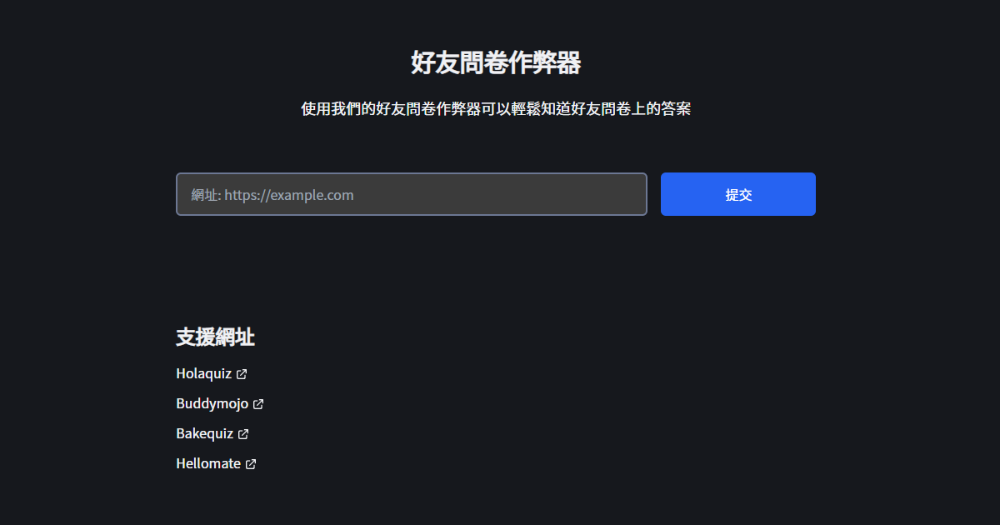

<div align="center">
  <a href="https://github.com/tszhong0411/friend-quiz">
    
  </a>
  <h3 align="center">好友問卷作弊器</h3>
  <p align="center">
    使用我們的好友問卷作弊器可以輕鬆知道好友問卷上的答案
  </p>
  <hr />
  <p align="center">
  
  </p>
</div>
<details>
  <summary>目錄</summary>
  <ol>
    <li>
      <a href="#關於這個項目">關於這個項目</a>
      <ul>
        <li><a href="#建立">建立</a></li>
      </ul>
    </li>
    <li>
      <a href="#開始">開始</a>
      <ul>
        <li><a href="#安裝">安裝</a></li>
      </ul>
    </li>
    <li><a href="#路線圖">路線圖</a></li>
    <li><a href="#貢獻">貢獻</a></li>
    <li><a href="#許可">許可</a></li>
    <li><a href="#聯絡">聯絡</a></li>
  </ol>
</details>

<!-- ABOUT THE PROJECT -->

## 關於這個項目

<p align="center">
  
</p>

我在 Instagram 上經常看見朋友發的好友問卷連結，我就想我能不能破解它，當我按下 <kbd>F12</kbd> 後有趣的事情發生了。

原因:

- 純粹好玩
- 能幫到別人 (?
- 練習我的 react, typescript, next.js

### 建立

這部分展示了我在項目中用到的技術

- [Next.js](https://nextjs.org/)
- [Tailwindcss](https://tailwindcss.com/)
- [Puppeteer](https://github.com/puppeteer/puppeteer)
- [React-toastify](https://github.com/fkhadra/react-toastify)
- [Husky](https://github.com/typicode/husky)

<!-- GETTING STARTED -->

## 開始

這是一個關於如何在本地設置項目的說明的示例。
要啟動並運行本地 clone，請按照以下簡單示例步驟操作。

### 安裝

1. Clone 這個 repo
   ```sh
   git clone https://github.com/tszhong0411/friend-quiz.git
   ```
2. 安裝 Package
   ```sh
   yarn
   ```
3. 本地運行
   ```sh
   yarn dev
   ```

## 路線圖

- [x] Support holaquiz
- [x] Support hellomate
- [x] Support buddymojo
- [x] Support bakequiz
- [ ] Multi-language Support
  - [ ] Chinese
  - [ ] English

請參閱 [open issues](https://github.com/tszhong0411/friend-quiz/issues) 以獲取建議功能（和已知問題）的完整列表。

<!-- CONTRIBUTING -->

## 貢獻

貢獻使開源社區成為學習、啟發和創造的絕佳場所。您所做的任何貢獻都**非常感謝**。

如果你有一個可以讓這變得更好的建議，請 fork 和 [Pull request](https://github.com/TszHong0411/friend-quiz/pulls) 創建一個拉取請求。您也可以簡單地打開帶有 `enhancement` 標籤的問題。
別忘了給項目 Star！再次感謝！

1. Fork the Project
2. Commit your Changes (`git commit -m 'Add some features'`)
3. Push to the Branch (`git push origin main`)
4. Open a Pull Request

<!-- LICENSE -->

## 許可

根據 MIT 許可證分發。有關更多信息，請參閱 [LICENSE](https://github.com/TszHong0411/friend-quiz/blob/main/LICENSE)。

<!-- CONTACT -->

## 聯絡

小康 - [@tszhong0411](https://www.instagram.com/tszhong0411/) - info@honghong.me

項目連結: [https://github.com/tszhong0411/friend-quiz](https://github.com/tszhong0411/friend-quiz)
