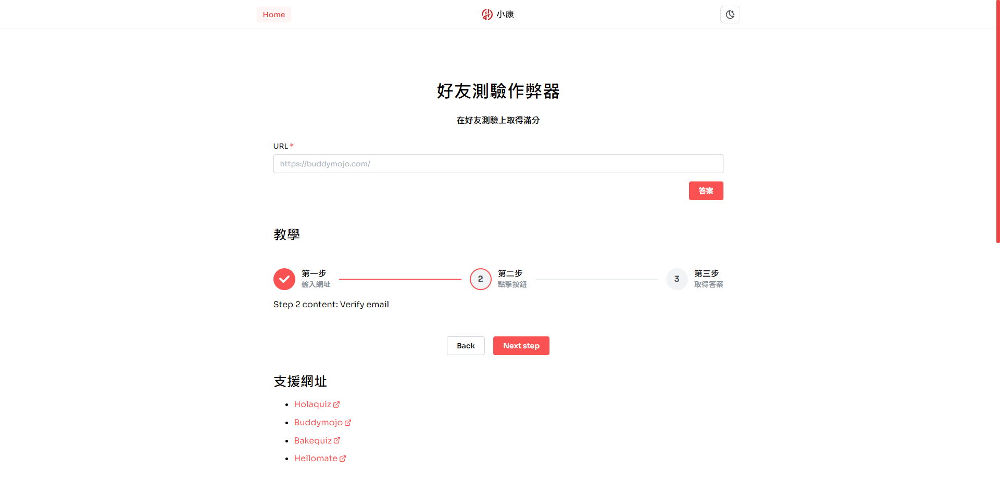

<p align="right">Lanuage: <a href="./README.zh-tw.md">中文</a> | English</p>
<div align="center">
  <h3 align="center">Friend Quiz Cheater</h3>
  <p align="center">
    Using our friend quiz cheater to get the full score on your friend quiz
  </p>
  <hr />
  <p align="center">
  
  </p>
</div>
<details>
  <summary>Table of contents</summary>
  <ol>
    <li>
      <a href="#about-the-project">About the project</a>
      <ul>
        <li><a href="#built-with">Built With</a></li>
      </ul>
    </li>
    <li>
      <a href="#getting-started">Getting Started</a>
      <ul>
        <li><a href="#installation">Installation</a></li>
      </ul>
    </li>
    <li><a href="#roadmap">Roadmap</a></li>
    <li><a href="#contributing">Contributing</a></li>
    <li><a href="#license">License</a></li>
    <li><a href="#contact">Contact</a></li>
  </ol>
</details>

<!-- ABOUT THE PROJECT -->

## About the project

<p align="center">
  
</p>

I often see a link to a friend quiz from a friend on Instagram, and I wonder if I can hack it, and something interesting happens when I press <kbd>F12</kbd>.

Reasons:

- Just fun
- Can help others (?
- Practice my react, typescript, next.js

### Built with

This part shows the techniques I used in the project

- [Next.js](https://nextjs.org/)
- [Husky](https://github.com/typicode/husky)

<!-- GETTING STARTED -->

## Getting started

This is an example of how you may give instructions on setting up your project locally. To get a local copy up and running follow these simple example steps.

### Installation

1. Clone this repo
   ```sh
   git clone https://github.com/tszhong0411/friend-quiz.git
   ```
2. Install Package
   ```sh
   yarn
   ```
3. Run locally
   ```sh
   yarn dev
   ```

## Roadmap

- [x] Support [Holaquiz](https://holaquiz.com)
- [x] Support [Buddymojo](https://buddymojo.com)
- [x] Support [Bakequiz](https://bakequiz.com)
- [x] Support [Hellomate](https://cn.hellomate.me)
- [x] Support [Friend2021](https://friend2021.com)
- [x] Support [Daremessage](https://daremessage.xyz)
- [x] Support [Dudequiz](https://www.dudequiz.com)
- [x] Support [Helopal](https://helopal.club)
- [x] Support [Quizyourfriends](https://www.quizyourfriends.com)
- [x] Support [Matequiz](https://www.matequiz.com)
- [x] Multi-language Support
  - [x] Chinese
  - [x] English

See the [open issues](https://github.com/tszhong0411/friend-quiz/issues) for a full list of proposed features (and known issues).

<!-- CONTRIBUTING -->

## Contributing

Contributions are what make the open source community such an amazing place to learn, inspire, and create. Any contributions you make are greatly appreciated.

If you have a suggestion that would make this better, please fork the repo and create a pull request. You can also simply open an issue with the tag `enhancement`. Don't forget to give the project a star! Thanks again!

1. Fork the Project
2. Commit your Changes (`git commit -m 'Add some features'`)
3. Push to the Branch (`git push`)
4. Open a Pull Request

<!-- LICENSE -->

## License

Distributed under the MIT License. See [LICENSE](https://github.com/TszHong0411/friend-quiz/blob/main/LICENSE) for more information.

<!-- CONTACT -->

## Contact

小康 - [@tszhong0411](https://www.instagram.com/tszhong0411/) - info@honghong.me

Project Link: [https://github.com/tszhong0411/friend-quiz](https://github.com/tszhong0411/friend-quiz)
